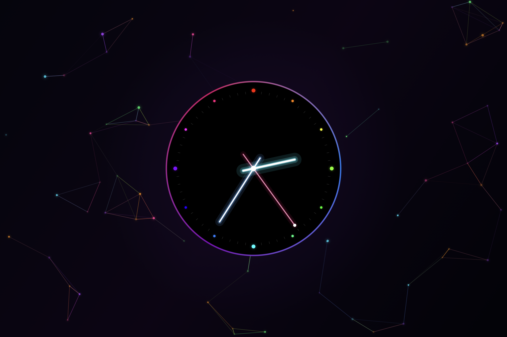
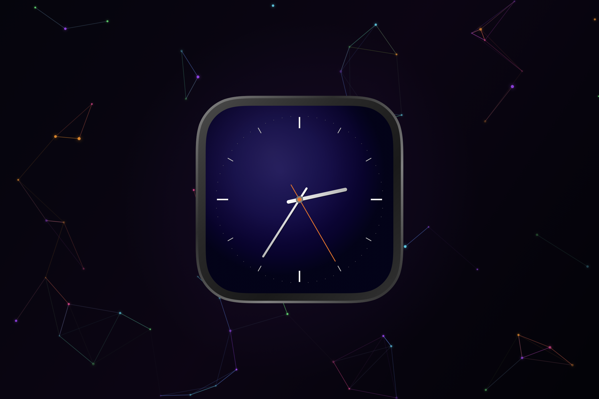
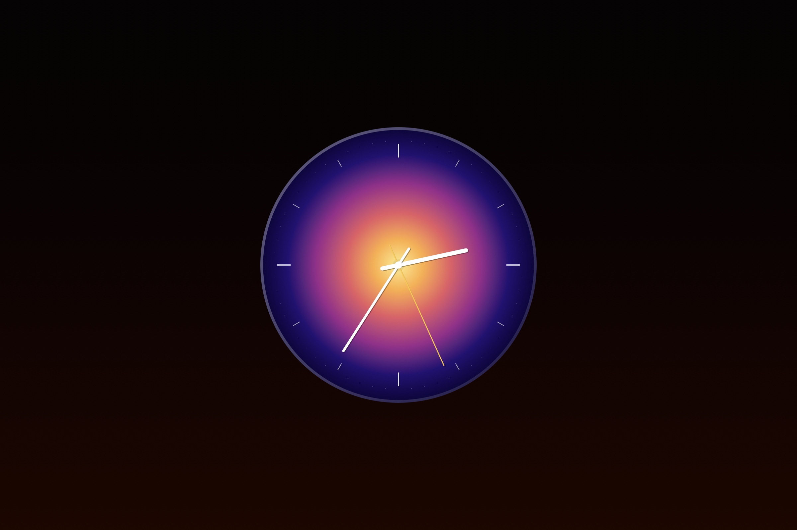

# ClockLock 🕐

A beautiful, high-performance macOS screen saver featuring 5 watchOS-inspired analog clock faces layered over 6 animated abstract backgrounds. Built natively using SwiftUI, Core Animation, and Metal-accelerated Canvas for ultra-smooth 120 FPS rendering.

<p align="center">
  
  
  
</p>

---

## Clock Faces

| Face | Style |
|------|-------|
| **Spectrum** | Jet-black circular dial with a full, cycling rainbow gradient ring and matching second hand. |
| **Neon** | Pure black dial with glowing electric cyan, ice blue, and hot pink neon batons. |
| **Sunrise** | Radial gradient dial flowing from warm gold to deep indigo, with minimal embossed indices. |
| **Void** | Gunmetal squircle watch case with a deep blue-violet radial dial and orange second hand. |
| **Crystal** | Concentric iridescent jewel-cut rings that slowly shimmer, drawn directly in native Canvas. |

## Backgrounds

| Background | Description |
|------------|-------------|
| **Aurora** | Sinusoidal color wave bands drifting slowly across a midnight base, rendered using CAGradientLayer. |
| **Nebula** | Deep space clouds drifting over a twinkling star field, with zero banding and zero noise. |
| **Wave** | Overlapping sine wave layers with shifting hues, using multi-stop GPU-accelerated gradients. |
| **Geometric** | Rotating hexagonal tessellation with shifting HSL color fills and central radial glow. |
| **Ember** | GPU particle-based rising fire embers driven entirely on the Core Animation render server. |
| **Constellation** | Metal-backed plexus of floating particles and a rotating 3D gyroscope with fading connections. |

---

## Requirements

- macOS 13.0 Ventura or later
- Xcode 15+ (for building from source)

---

## Building & Installing

### Recommended: DMG Installer Package
You can package the screen saver as a mountable macOS disk image (`.dmg`) for easy drag-and-drop installation and distribution:

```bash
# Run the packaging script
./create_dmg.sh
```

This will:
1. Clean and build `ClockLock.saver` in Release configuration.
2. Create a mountable `ClockLock.dmg` containing the screensaver and a symlink shortcut to `/Library/Screen Savers`.

**To Install:**
1. Double-click the generated `ClockLock.dmg` to mount it.
2. Drag `ClockLock.saver` onto the `Screen Savers` shortcut.
3. Open **System Settings → Screen Saver**, select **ClockLock**, and click **Options** to customize your configuration.

**To Uninstall:**
- Navigate to `/Library/Screen Savers` (or `~/Library/Screen Savers` if installed locally) and delete `ClockLock.saver`.

---

### Alternative: Script Build & Install (Local User Only)
If you prefer to build and install it directly to your personal home directory without creating a DMG:

```bash
# Build and install to ~/Library/Screen Savers/
./build.sh
```

The script will build the release version and install it to `~/Library/Screen Savers/`.

---


## Manual Xcode Build

1. Open `ClockLock.xcodeproj` in Xcode.
2. Select the **ClockLock** scheme.
3. Build with **⌘B** (or Product → Build).
4. The `.saver` bundle will be built and copied to `~/Library/Screen Savers/`.

---

## Project Structure

```
ClockLock/
├── ClockLockView.swift          # ScreenSaverView entry point & hosting layer configuration
├── ClockHostView.swift          # SwiftUI root composition (background + clock scaling)
├── ClockSettings.swift          # Observable preferences model (UserDefaults suite backing)
├── PreferencesController.swift  # NSWindowController hosting the options sheet
├── PreferencesView.swift        # SwiftUI preferences options and preview cards UI
├── Backgrounds/
│   ├── AuroraBackground.swift
│   ├── NebulaBackground.swift
│   ├── WaveBackground.swift
│   ├── GeomBackground.swift
│   ├── EmberBackground.swift
│   └── ConstellationBackground.swift
└── Clocks/
    ├── ClockModernity.swift     # Defines ClockSpectrum
    ├── ClockChronograph.swift   # Defines ClockNeon
    ├── ClockArtistic.swift      # Defines ClockSunrise
    ├── ClockNoir.swift          # Defines ClockVoid
    └── ClockSolar.swift         # Defines ClockCrystal
```

---

## Code Quality & Standards

To maintain standard formatting and prevent common coding bugs, this project includes configuration files for the following industry-standard tools:

- **[SwiftLint](https://github.com/realm/SwiftLint)**: Configured in [`.swiftlint.yml`](.swiftlint.yml) to enforce code structure rules, line/file length limits, and prevent unsafe patterns.
- **[SwiftFormat](https://github.com/nicklockwood/SwiftFormat)**: Configured in [`.swiftformat`](.swiftformat) to automatically format braces, indentation, and spaces according to standard Swift styles.
- **[EditorConfig](https://editorconfig.org)**: Configured in [`.editorconfig`](.editorconfig) to ensure consistent line endings, indent styles, and whitespace across different editors (Xcode, VS Code, etc.).

### Automatic Formatting (Recommended)
If you have `swiftformat` and `swiftlint` installed locally, you can format the codebase using:
```bash
# Format Swift files
swiftformat .

# Lint Swift files
swiftlint lint
```

---

## License

MIT License. See [LICENSE](LICENSE) for more details.
